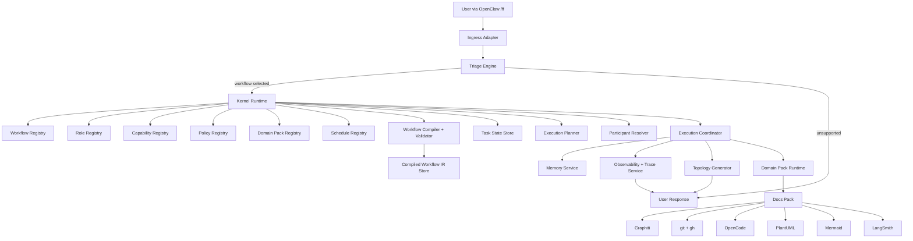

# ARCHITECTURE.md

# Loom Architecture

**System name:** Loom
**System type:** Generic workflow-first multi-agent orchestration kernel
**Primary first-party domain pack:** Docs Pack
**Initial ingress surface:** `/ff ...` on top of OpenClaw
**Primary implementation language:** Python

---

# 1. Purpose of this Document

This document defines the architecture of Loom in enough detail that an implementation agent or engineering team can build it end to end.

This document is intentionally split into:

1. **High-Level Design (HLD)** – system shape, major components, responsibilities, runtime flow, and architectural boundaries.
2. **Low-Level Design (LLD)** – internal models, registries, state machines, compilation pipeline, runtime execution details, storage, APIs, events, memory integration, scheduling, and component contracts.

This architecture document assumes the product direction described in `PRD.md`:

* Loom is a **generic kernel**, not a docs-only app.
* Workflows are authored in **natural-language markdown**.
* Workflow markdown is compiled into validated machine-readable IR.
* Roles and runtime participants are **registry-driven**, not bespoke hardcoded classes.
* Docs is the **first domain pack**, not the entire system.

---

# 2. Architectural Intent

Loom exists to provide **structure to chaos**.

Most agentic systems either:

* become too free-form and difficult to govern,
* become too hardcoded and inflexible,
* or become so domain-specific that they are not reusable.

Loom is designed to sit in the middle:

* **thin enough** to remain generic,
* **strict enough** to enforce workflows,
* **dynamic enough** to support runtime participant resolution,
* **safe enough** to keep memory and policies under control,
* and **extensible enough** to support multiple domain packs.

The key architectural principle is:

> Loom should own orchestration, coordination, compilation, validation, policy, state, memory scoping, and observability — but it should not own domain logic that belongs in a domain pack.

---

# 3. System Context

Loom lives between natural-language user requests and domain-specific execution.

### Upstream

* OpenClaw acts as the user-facing ingress shell.
* The user submits requests through `/ff ...`.

### Internal

* Loom classifies the request.
* Loom selects a workflow.
* Loom resolves runtime participants.
* Loom enforces step progression.
* Loom persists state and memory.
* Loom delegates domain-specific execution through domain-pack capabilities and connectors.

### Downstream

Depending on the active domain pack, Loom may interact with:

* Graphiti for memory,
* git and gh for repository and PR operations,
* OpenCode for repository context assembly,
* PlantUML for curated diagram generation,
* Mermaid for topology rendering,
* LangSmith for runtime observability,
* validation engines for build/style/link verification.

---

# 4. High-Level Design (HLD)

## 4.1 Architectural Overview

Loom is organized into nine primary layers:

1. **Ingress Layer**
2. **Triage Layer**
3. **Kernel Layer**
4. **Compilation Layer**
5. **Execution Layer**
6. **Registry Layer**
7. **Memory Layer**
8. **Observability Layer**
9. **Domain Pack Layer**

These layers are logical, not necessarily separate deployable services.
In v1, Loom should be implemented as a single Python application with clean internal module boundaries.

---

## 4.2 HLD Component Diagram



---

## 4.3 Layer Responsibilities

### 4.3.1 Ingress Layer

Responsibility:

* receive natural-language `/ff ...` requests from OpenClaw,
* normalize request payload,
* call Loom’s task intake API,
* stream progress and results back.

The ingress layer should remain intentionally small.
It should not contain workflow logic.

---

### 4.3.2 Triage Layer

Responsibility:

* classify user intent,
* extract entities,
* map request to one of the active workflows,
* reject unsupported requests,
* create initial task record.

Triage is the gatekeeper.
No request should enter execution until triage has either:

* selected a workflow,
* requested minimal missing information,
* or rejected the request.

---

### 4.3.3 Kernel Layer

Responsibility:

* enforce workflow-first execution,
* manage task lifecycle,
* manage transitions,
* resolve roles to runtime participants,
* apply policies,
* control memory scope,
* invoke compilation if needed,
* coordinate schedules,
* orchestrate execution without being domain-specific.

This is the core of Loom.

---

### 4.3.4 Compilation Layer

Responsibility:

* read natural-language workflow markdown,
* parse required sections,
* compile markdown into structured IR,
* validate syntax and semantics,
* publish valid versions,
* reject invalid versions.

This layer allows humans to author workflows naturally without exposing low-level IR as the primary authoring interface.

---

### 4.3.5 Execution Layer

Responsibility:

* instantiate or resolve runtime participants,
* coordinate collaborative steps,
* pass context and memory,
* collect outputs,
* update task state,
* enforce completion rules,
* transition to next step.

This layer should remain generic and driven by compiled workflow IR.

---

### 4.3.6 Registry Layer

Responsibility:

* store and serve definitions for workflows, roles, capabilities, policies, prompt profiles, domain packs, schedules, and runtime participant templates.

Registries are the backbone of Loom’s genericity.

---

### 4.3.7 Memory Layer

Responsibility:

* manage working, episodic, semantic, and consolidated memory,
* enforce memory visibility rules,
* bind memory to workflow versions and scopes,
* support forgetting and invalidation,
* integrate with Graphiti.

---

### 4.3.8 Observability Layer

Responsibility:

* record traces, events, transitions, failures, participant resolution, memory accesses, schedule runs, and final outcomes,
* expose status and introspection,
* integrate with LangSmith.

---

### 4.3.9 Domain Pack Layer

Responsibility:

* contribute domain-specific workflow markdown,
* provide role definitions and capabilities,
* provide connectors and validation adapters,
* provide prompts and policies,
* extend the kernel without changing the kernel.

Docs Pack is the first domain pack.

---

## 4.4 Primary Runtime Flow

### 4.4.1 Task ingress flow

1. User issues `/ff <natural language request>`.
2. OpenClaw forwards the request to Loom.
3. Loom creates a raw task record.
4. Triage classifies the request and extracts entities.
5. Triage selects a matching workflow version.
6. Kernel loads the compiled workflow IR.
7. Kernel initializes task state.
8. Execution planner enters the first step.
9. Participant resolver binds owners and collaborators.
10. Execution coordinator runs the step.
11. Outputs, events, and memory updates are recorded.
12. Task transitions until complete, blocked, or failed.
13. Result is streamed back to the user.

---

## 4.5 Key Architectural Decisions

### 4.5.1 Workflows are authored in markdown

This keeps workflows human-readable and easy to edit.

### 4.5.2 Workflow IR is generated, not authored

This preserves a clean separation between human authoring and machine execution.

### 4.5.3 Roles are abstract; runtime participants are concrete

This allows dynamic resolution and scaling.

### 4.5.4 Steps are ownership-based, not execution-mode-based

A step is described in terms of:

* who owns it,
* who may collaborate,
* what capabilities are required,
* how many runtime participants may be spawned,
* what completion means.

### 4.5.5 Docs is just a domain pack

This prevents kernel contamination.

### 4.5.6 Memory is scoped and version-aware

This prevents stale retrieval when workflows evolve.

### 4.5.7 Policies are explicit and enforceable

No hidden merge behavior, no invisible write paths, no ambiguous permissions.

---

# 5. Low-Level Design (LLD)

## 5.1 Internal Module Layout

Suggested Python package layout:

```text
loom/
  app/
    main.py
    config.py
    dependency_injection.py

  ingress/
    openclaw_adapter.py
    request_models.py
    response_models.py

  triage/
    classifier.py
    entity_extractor.py
    selector.py
    intake_service.py

  kernel/
    task_service.py
    workflow_service.py
    participant_resolver.py
    execution_planner.py
    execution_coordinator.py
    transition_engine.py
    policy_engine.py
    state_machine.py

  compiler/
    markdown_parser.py
    section_normalizer.py
    llm_compiler.py
    ir_models.py
    ir_validator.py
    compiler_service.py

  registries/
    workflow_registry.py
    role_registry.py
    capability_registry.py
    prompt_registry.py
    policy_registry.py
    domain_pack_registry.py
    schedule_registry.py
    participant_registry.py

  memory/
    memory_service.py
    working_memory.py
    episodic_memory.py
    semantic_memory.py
    consolidation_service.py
    invalidation_service.py
    graphiti_adapter.py

  execution/
    step_runner.py
    collaborative_step_runner.py
    completion_evaluator.py
    context_assembler.py
    runtime_bindings.py

  observability/
    event_bus.py
    trace_service.py
    topology_service.py
    audit_log_service.py

  scheduling/
    scheduler_service.py
    cron_adapter.py

  domainpacks/
    docs/
      pack_manifest.yaml
      workflows/
      roles/
      prompts/
      policies/
      capabilities/
      validations/
      connectors/

  adapters/
    git_adapter.py
    gh_adapter.py
    opencode_adapter.py
    plantuml_adapter.py
    mermaid_adapter.py
    langsmith_adapter.py

  persistence/
    db_models.py
    repositories.py
    migrations/
```

This structure is a recommendation, not a strict requirement, but the separation of concerns is important.

---

## 5.2 Core Domain Model

## 5.2.1 Task Model

A task is the top-level runtime object.

### Suggested fields

* `task_id`
* `raw_request`
* `normalized_request`
* `domain
